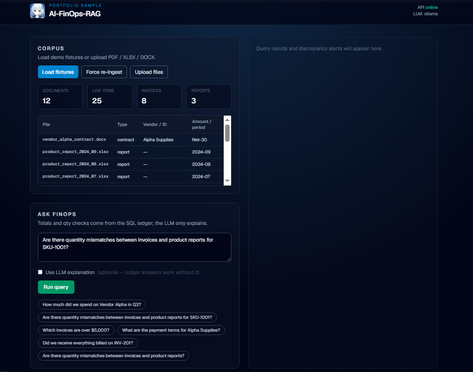
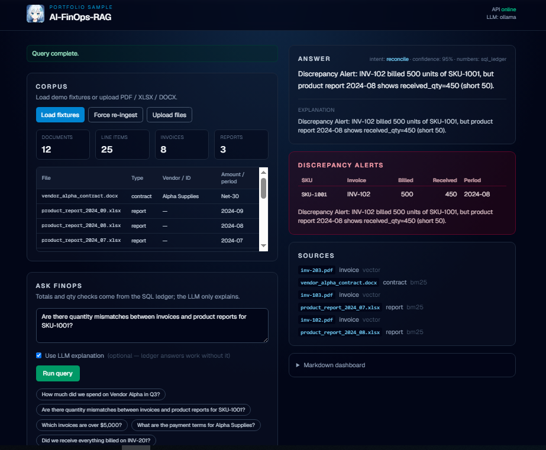
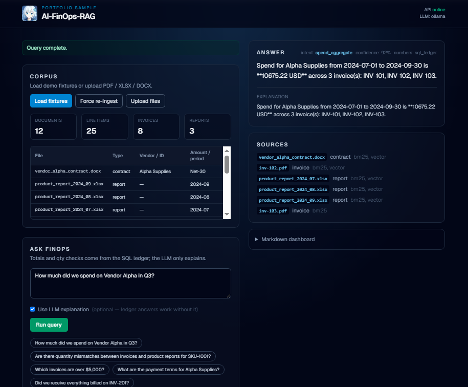
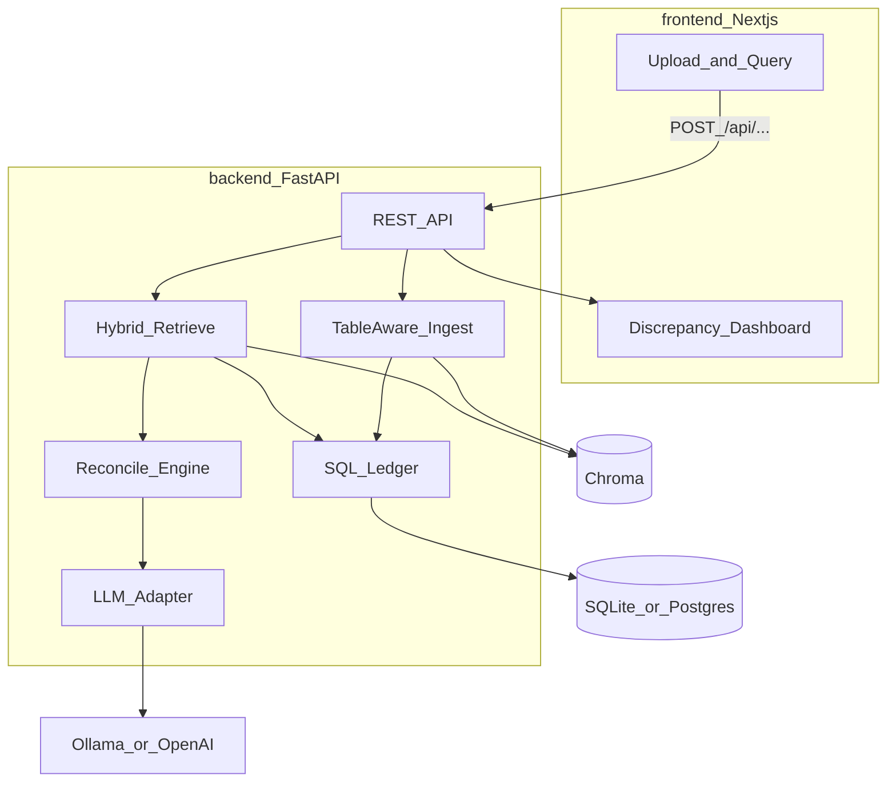

# AI-FinOps-RAG

Portfolio sample: **table-aware RAG** for vendor invoices, product reports, and contracts — with deterministic number reconciliation and an LLM that *explains* discrepancies (not invents the math).

| Layer | Role |
| --- | --- |
| **Frontend** | Next.js App Router — upload docs, ask FinOps questions, discrepancy dashboard |
| **Backend** | FastAPI — ingest → chunk → index → hybrid retrieve → SQL reconcile → LLM explain |
| **LLM** | Env switch: Ollama (`phi3:mini`) / OpenAI / Anthropic / mock |
| **App DB** | Env switch: SQLite (quick demo) / Postgres (Docker) — docs registry + query history |
| **Vectors** | Chroma (local) + optional BM25 — semantic + exact ID/amount retrieval |
| **Ledger** | Structured line items in SQL — filters like `total > 5000` and qty mismatch checks |

Differentiates from narrative RAG ([AI-Resume-Reviewer](https://github.com/kondotakuya65/AI-Resume-Reviewer)) and code RAG ([AI-Code-Reviewer-Sample](https://github.com/kondotakuya65/AI-Code-Reviewer-Sample)).

**Docs:** [Scenario](docs/01-scenario.md) · [Architecture](docs/02-architecture.md) · [Implementation plan](docs/03-implementation-plan.md) · [Data & eval](docs/04-data-and-eval.md) · [Design decisions](docs/05-design-decisions.md) · [Docs index](docs/README.md)

---

## Demo walkthrough

1. Start backend + frontend (Quick start below).  
2. Open http://localhost:3000 and click **Load fixtures**.  
3. Run *“Are there quantity mismatches … SKU-1001?”* → **Discrepancy Alert** (500 billed vs 450 received).  
4. Run *“How much did we spend on Vendor Alpha in Q3?”* → **$10,675.22** from the SQL ledger.  
5. Optional: enable **Use LLM explanation** once Ollama/`phi3:mini` is warm.  
6. Stretch: *“Should we accept INV-104 … PO-4452?”* → **Reject** (price 8% over contract).

### Screenshots

| Dashboard | Discrepancy result | Spend / answer |
| --- | --- | --- |
|  |  |  |

---

## Architecture



**Design rule:** retrieve context with RAG; **compute** totals/qty with SQL/Pandas; use the LLM only for narrative answers and **Discrepancy Alerts**.

---

## Stack

| Concern | Choice |
| --- | --- |
| Frontend | Next.js (App Router), TypeScript |
| Backend | FastAPI, Pydantic Settings |
| LLM | `LLM_PROVIDER=ollama\|openai` — default `phi3:mini` via Ollama |
| App DB | SQLAlchemy — `DATABASE_URL` SQLite or Postgres |
| Vector DB | Chroma (persisted locally) |
| Keyword | BM25 (`rank_bm25`) for invoice # / SKU / amounts |
| Parse | pdfplumber, pandas, openpyxl, python-docx |
| Embeddings | sentence-transformers (local default); optional OpenAI embeddings |
| Eval | pytest + golden Q&A in `fixtures/evals/` |

---

## Repo layout

```
/
├── backend/app/       FastAPI + ingest/retrieve/ledger/reconcile
├── frontend/          Next.js workspace
├── fixtures/          synthetic invoices, reports, contract, ground truth
├── scripts/           generate_fixtures.py (rebuild corpus from code)
├── docs/              scenario, architecture, implementation plan
├── docker-compose.yml
└── .env.example
```

---

## Quick start

### Backend

```bash
cd backend
python -m venv .venv
# Windows: .venv\Scripts\Activate.ps1
pip install -r requirements.txt
uvicorn app.main:app --reload --port 8000
```

Ingest fixtures (ledger + Chroma):

```bash
python -m app.ingest.cli
# or POST http://localhost:8000/api/ingest  {"load_fixtures": true}
# re-run skips unchanged files (content-hash cache); use --force to rebuild
```

- API docs: http://localhost:8000/docs  
- Health: http://localhost:8000/api/health  
- Ingest status: http://localhost:8000/api/ingest/status  

Set `EMBEDDING_PROVIDER=hash` for offline/tests (no model download). Default is `local` (sentence-transformers).

Ask a FinOps question (after ingest):

```bash
curl -s http://localhost:8000/api/query -H "Content-Type: application/json" ^
  -d "{\"question\": \"Are there quantity mismatches for SKU-1001?\", \"use_llm\": true}"
```

Numbers always come from the SQL ledger; the LLM only explains. Use `LLM_PROVIDER=mock` for offline demos.

### Stretch (Phase 6)

| Flag | Values | Notes |
| --- | --- | --- |
| `PDF_PARSER` | `pdfplumber` (default), `llamaparse` | Needs `LLAMA_CLOUD_API_KEY` + `llama-parse` |
| `VECTOR_BACKEND` | `chroma` (default), `postgres` | Postgres stores embeddings in `vector_chunks` (pgvector-ready) |

Invoice review API:

```bash
curl -s http://localhost:8000/api/review -H "Content-Type: application/json" ^
  -d "{\"invoice_id\": \"INV-104\"}"
```

Expected: `recommendation: Reject` — matches `PO-4452`, but SKU-1001 is ~8% over the Alpha contract unit price.

```bash
# EMBEDDING_PROVIDER=hash LLM_PROVIDER=mock recommended
python -m app.eval.cli
# or: pytest tests/test_eval_runner.py -q
```

### Frontend

```bash
cd frontend
cp .env.local.example .env.local
npm install
npm run dev
```

Open http://localhost:3000 — **Load fixtures**, then use a demo question (e.g. SKU-1001 discrepancy).

### Docker (optional)

```bash
cp .env.example .env
docker compose up --build
```

- UI: http://localhost:3000  
- API: http://localhost:8000/docs  

---

## Roadmap

1. **Done:** README, env knobs, backend skeleton, fixtures layout, `/docs`, Next.js shell + favicon  
2. **Done:** Synthetic dataset + ground-truth JSON (intentional discrepancies)  
3. **Done:** Ingest (table-aware chunks + SQL ledger + Chroma + content-hash cache)  
4. **Done:** Query (hybrid retrieve → reconcile → LLM explain → markdown)  
5. **Done:** Next.js UI (upload / query / alerts) + Docker Compose  
6. **Done:** Eval harness + CI + Anthropic provider  
7. **Done:** Stretch — PO/price-drift review, Postgres vectors, LlamaParse flag  

---

## License

MIT
