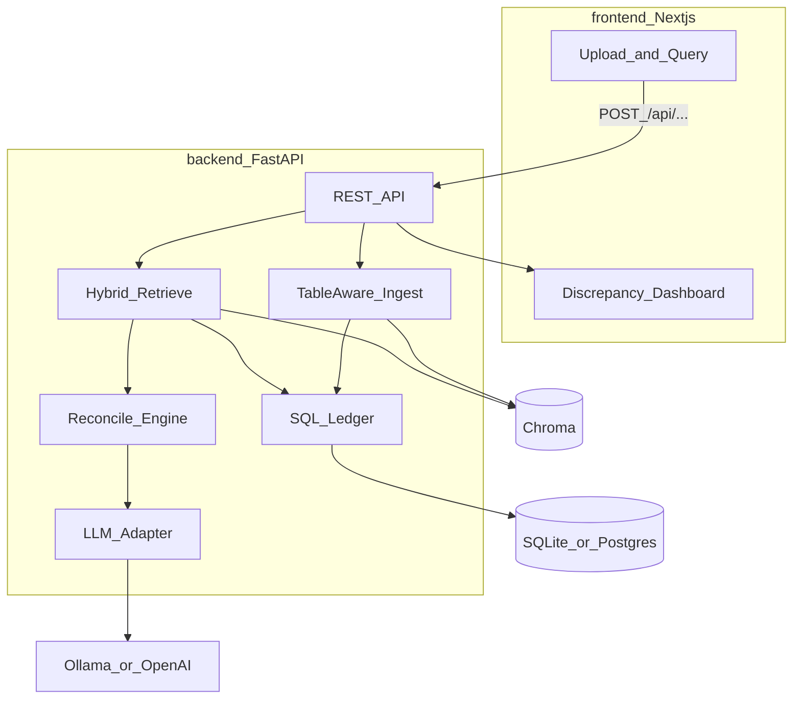

# AI-FinOps-RAG

Portfolio sample: **table-aware RAG** for vendor invoices, product reports, and contracts — with deterministic number reconciliation and an LLM that *explains* discrepancies (not invents the math).

| Layer | Role |
| --- | --- |
| **Frontend** | Next.js App Router — upload docs, ask FinOps questions, discrepancy dashboard |
| **Backend** | FastAPI — ingest → chunk → index → hybrid retrieve → SQL reconcile → LLM explain |
| **LLM** | Env switch: Ollama (`phi3:mini`) / OpenAI (same adapter pattern as my other samples) |
| **App DB** | Env switch: SQLite (quick demo) / Postgres (Docker) — docs registry + query history |
| **Vectors** | Chroma (local) + optional BM25 — semantic + exact ID/amount retrieval |
| **Ledger** | Structured line items in SQL — filters like `total > 5000` and qty mismatch checks |

Differentiates from narrative RAG ([AI-Resume-Reviewer](https://github.com/kondotakuya65/AI-Resume-Reviewer)) and code RAG ([AI-Code-Reviewer-Sample](https://github.com/kondotakuya65/AI-Code-Reviewer-Sample)).

**Docs:** [Scenario](docs/01-scenario.md) · [Architecture](docs/02-architecture.md) · [Implementation plan](docs/03-implementation-plan.md) · [Data & eval](docs/04-data-and-eval.md) · [Design decisions](docs/05-design-decisions.md) · [Docs index](docs/README.md)

---

## Architecture



**Design rule:** retrieve context with RAG; **compute** totals/qty with SQL/Pandas; use the LLM only for narrative answers and **Discrepancy Alerts**.

---

## Stack

| Concern | Choice |
| --- | --- |
| Frontend | Next.js (App Router), TypeScript |
| Backend | FastAPI, Pydantic Settings |
| LLM | `LLM_PROVIDER=ollama\|openai` — default `phi3:mini` via Ollama |
| App DB | SQLAlchemy — `DATABASE_URL` SQLite or Postgres |
| Vector DB | Chroma (persisted locally) |
| Keyword | BM25 (`rank_bm25`) for invoice # / SKU / amounts |
| Parse | pdfplumber, pandas, openpyxl, python-docx |
| Embeddings | sentence-transformers (local default); optional OpenAI embeddings |
| Eval | pytest + golden Q&A in `fixtures/evals/` |

---

## Repo layout

```
/
├── backend/app/
│   ├── api/          health, ingest, query
│   ├── db/           SQLAlchemy models + session (sqlite | postgres)
│   ├── llm/          ollama | openai adapter
│   ├── ingest/       PDF/Excel/DOCX → table-aware chunks + ledger rows
│   ├── retrieve/     Chroma + BM25 + hybrid
│   ├── ledger/       structured amounts / quantities
│   └── reconcile/    invoice ↔ report mismatch detection
├── frontend/         Next.js workspace (scaffold next)
├── fixtures/         synthetic invoices, reports, contract, golden Q&A
├── docker-compose.yml
└── .env.example
```

---

## Quick start (skeleton)

```bash
cp .env.example .env
# set LLM_PROVIDER=ollama and ensure `ollama pull phi3:mini`
# or set LLM_PROVIDER=openai and OPENAI_API_KEY

cd backend
python -m venv .venv
# Windows: .venv\Scripts\Activate.ps1
# macOS/Linux: source .venv/bin/activate
pip install -r requirements.txt
uvicorn app.main:app --reload --port 8000
```

- API docs: http://localhost:8000/docs  
- Health: http://localhost:8000/api/health  

Frontend and full ingest/query pipelines land in follow-up commits.

### Docker (optional)

```bash
cp .env.example .env
docker compose up --build
```

---

## Roadmap

1. **Done:** README, env knobs, backend skeleton, fixtures layout, `/docs`, Next.js shell + favicon  
2. **Synthetic dataset** + ground-truth JSON (intentional discrepancies)  
3. **Ingest:** table-aware chunking + SQL ledger + Chroma index + content-hash cache  
4. **Query:** hybrid retrieve → reconcile → LLM explain → markdown summary  
5. **Next.js UI** (upload / query / alerts) + Docker Compose polish  
6. **Eval harness** (golden Q&A)  
7. **Stretch:** upload invoice → match PO / contract unit price alert  

---

## License

MIT
